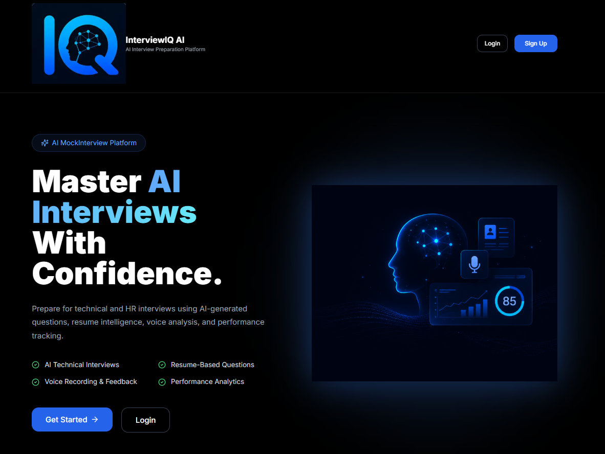
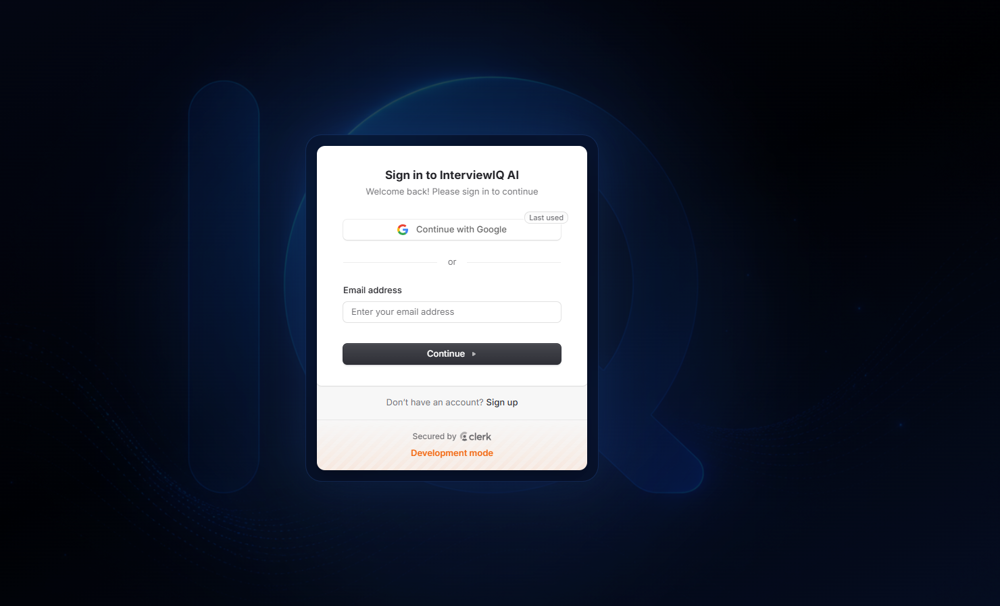
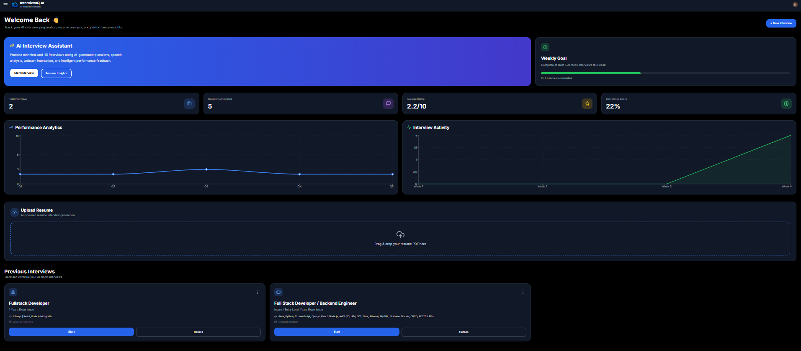
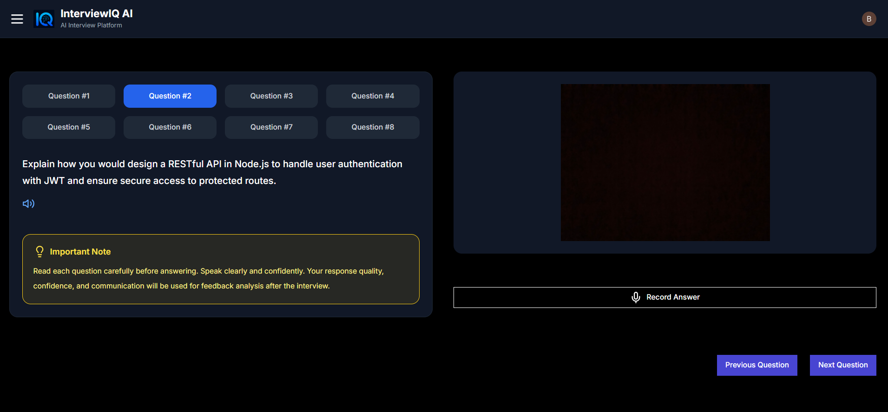
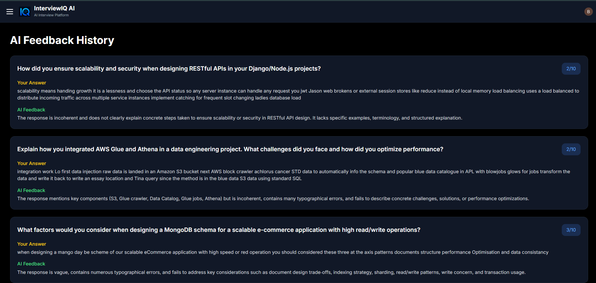

# 🚀 InterviewIQ AI

<div align="center">

# AI-Powered Mock Interview Platform

Practice AI-generated interviews, analyze resumes, track interview performance, and receive intelligent AI feedback through a modern SaaS-style platform.

<br/>


</div>

---

# 🌐 Live Demo

## 🔗 Deployed Application

https://interview-iq-ai-beryl.vercel.app/

---

# 📖 Project Overview

InterviewIQ AI is a modern AI-powered mock interview platform developed to help students and job seekers prepare for technical and HR interviews through personalized AI-generated interview experiences.

The platform allows users to:

- Create AI-generated mock interviews
- Upload and analyze resumes
- Practice interviews using webcam & microphone
- Receive AI-generated feedback and ratings
- Track interview analytics and confidence scores
- Maintain secure user-specific dashboards

The project follows a production-style SaaS architecture with secure authentication, authorization, analytics tracking, and multi-user isolation.

---

# 🏠 Landing Page

The landing page introduces the platform with a modern UI, AI-focused branding, authentication flow, and feature highlights.



---

# 🔐 Authentication System

Secure authentication system powered by Clerk with protected routes, session management, and user-specific dashboard access.



---

# 📊 Analytics Dashboard

The dashboard provides interview statistics, confidence scores, activity tracking, and performance analytics for each individual user.



---

# 🎤 AI Interview Experience

Users can start AI-generated mock interviews with webcam and microphone support for a realistic interview environment.



---

# 🧠 AI Feedback System

The platform evaluates user answers and provides ratings, ideal answers, and AI-generated improvement suggestions.



---

# ✨ Core Features

## 🔐 Authentication & Authorization

- Secure authentication using Clerk
- Protected dashboard routes
- Multi-user isolated dashboards
- User-specific interview history
- Authorization-based interview access
- Secure API route handling

---

## 🤖 AI Interview Generation

- AI-generated technical interview questions
- HR interview generation
- Role-based interview flow
- Experience-level interview generation
- Tech-stack based AI questions

---

## 📄 Resume Analysis

- Resume PDF upload support
- Automatic PDF text extraction
- AI-based resume analysis
- Resume-driven interview Questions and preparation

---

## 🎤 Interview Simulation

- Webcam-enabled interviews
- Microphone-based answer recording
- Real-time interview experience
- Professional interview interface

---

## 🧠 AI Feedback & Evaluation

- AI-generated feedback
- Question-wise ratings
- Ideal answer suggestions
- Performance improvement analysis
- Confidence scoring

---

## 📊 Analytics System

- Interview activity tracking
- Performance analytics
- User-specific charts
- Question completion statistics
- Confidence score tracking

---

# 🛠️ Tech Stack

# Frontend

- Next.js 14
- React.js
- Tailwind CSS
- Shadcn UI
- Lucide React

---

# Backend

- Next.js API Routes
- Server-side AI processing

---

# Database

- Neon PostgreSQL
- Drizzle ORM

---

# Authentication

- Clerk Authentication

---

# AI & Resume Processing

- OpenRouter AI
- AI-powered Interview Generation
- AI Feedback Generation
- PDF Parse

---

# Deployment

- Vercel

---

# 🧠 System Architecture

```text
User
   ↓
Clerk Authentication
   ↓
Next.js Frontend
   ↓
OpenRouter AI Processing
   ↓
Neon PostgreSQL Database
   ↓
Analytics & Feedback Engine
```

---

# 🔒 Security Features

## ✅ Protected Routes

Only authenticated users can access dashboard pages.

---

## ✅ Multi-User Isolation

Each user can only:
- View their own interviews
- Access their own analytics
- View their own feedback
- Delete their own interview records

---

## ✅ Authorization Layer

Interview routes validate ownership before allowing access.

---

## ✅ Environment Variable Protection

Sensitive API keys are protected using environment variables.

---

# 📂 Folder Structure

```text
InterviewIQ-AI/
│
├── screenshots/
│   ├── landing.png
│   ├── signin.png
│   ├── dashboard.png
│   ├── interview.png
│   └── feedback.png
│
├── app/
│   ├── api/
│   ├── dashboard/
│   ├── sign-in/
│   ├── sign-up/
│   └── interview/
│
├── components/
├── utils/
├── public/
├── README.md
```

---

# ☁️ Deployment

The project is fully deployed on:

- Vercel
- Neon PostgreSQL
- Clerk Authentication
- OpenRouter AI

---

# 📌 Future Improvements

- 🎙️ AI Voice Interviewe
- 💻 Coding Interview Mode
- 📹 Interview Recording
- 📄 PDF Feedback Export
- 🏆 Leaderboard System
- 🔥 Interview Streak Tracking

---

# 🧪 Current Project Status

| Feature | Status |
|---|---|
| Authentication | ✅ Completed |
| AI Interview Generation | ✅ Completed |
| Resume Analysis | ✅ Completed |
| Analytics Dashboard | ✅ Completed |
| Multi-User Isolation | ✅ Completed |
| Production Deployment | ✅ Completed |
| Responsive UI | ✅ Completed |

---

# 👨‍💻 Author

## Bobbili Sindhuja

B.Tech IT Student  
AI & Full Stack Developer

---

# ⭐ Final Note

InterviewIQ AI is not just a frontend UI project.  
It is a deployed AI-powered SaaS-style application implementing authentication, authorization, analytics, AI integration, database management, and user-specific secure architecture.

---
